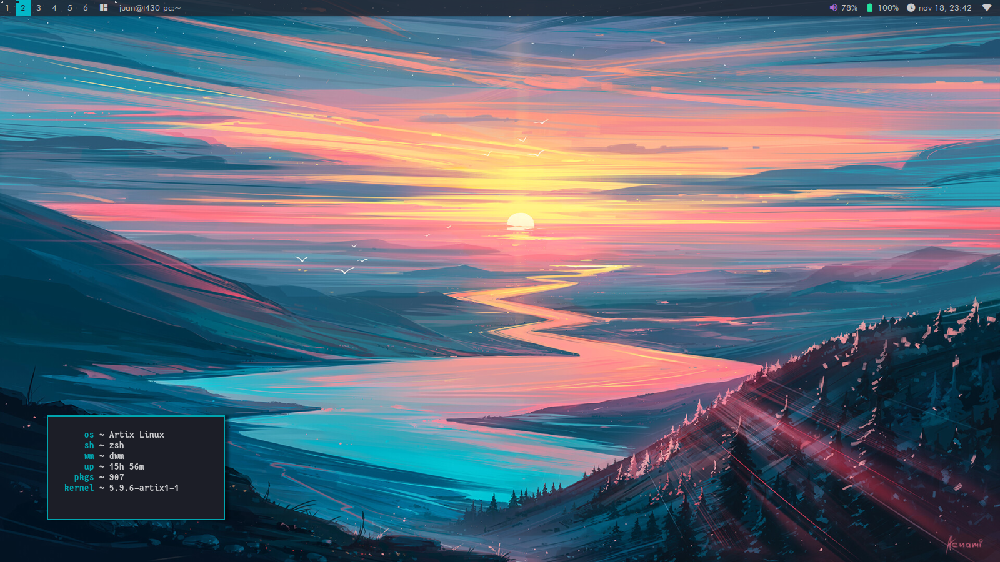
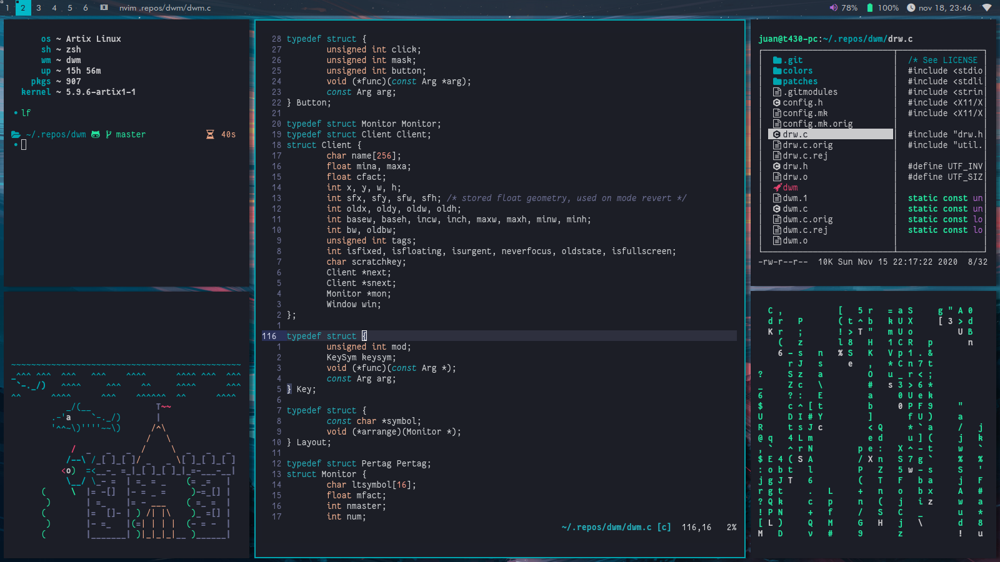

# dwm: Dynamic Window Manager

Welcome to my personal build of dwm! This is my own build of dwm, with many patches, some of them adds very basics features, but others adds cool features not present on others tiling window managers. Feel free to study all the source code! 

## Some features of my build are:
- Configurable transparency for the panel (it needs a compositor)
- cfacts and drafcfact: change the height of a stack window, with keyboard and mouse!
- Vanity gaps: Adds gaps, and customize every gap through keybindings.
- Colorbar: Different colors for every part of the panel.
- Fake fullscreen: make a window as fullscreen, without actually go to fullscreen!
- Netclientstacking: This allows some applications to detect the list of windows open. My use case is share screen on Zoom.
- Various layouts!: not only master and stack. Select between fibbonacci, deck, monocle, dwindle, grid, double deck, centered master and more.
- Scratchpad: like on i3wm: a keybinding hide a window. There's no need to define rules for specific programs, any window can be a scratchpad.
- Support for dwmblocks, with clickability and colors!

And of course all the features of dwm like tags and a very small footprint.

